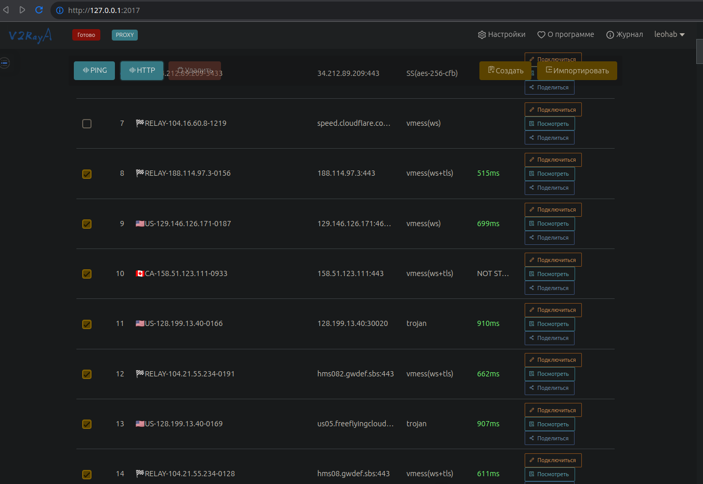

# install_v2raya
## только для .deb

```
git clone https://github.com/leohab75/install_v2raya.git && cd install_v2raya/ && sudo bash install_v2ray
```
### 1. кнопка запуска будет в меню приложений на вкладке интернет
### 2. При нажатии на иконку браузер откроется сам на 127.0.0.1:2017
### 3. ссылка на конф. файл будет скопированна в буфер обмена ⤵️
#### https://raw.githubusercontent.com/mahdibland/ShadowsocksAggregator/master/Eternity.txt
####  (при первом запуске её нужно будет вставить в соответствующее поле, а дельше просто обновлять)

## Пример установки и первого запуска (kubuntu)

[] (https://www.youtube.com/watch?v=t4VMaeddnNM)


# Удалить
## remove_v2raya


```
sudo bash remove_v2ray
```
